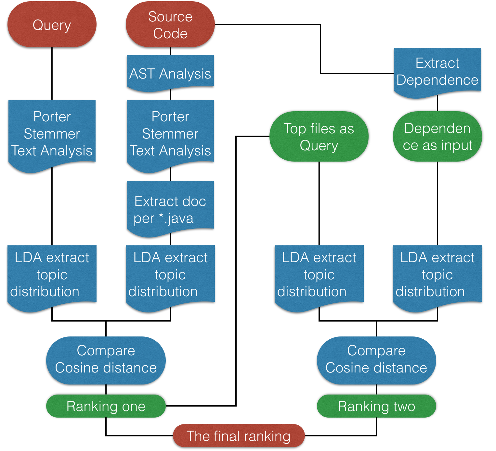
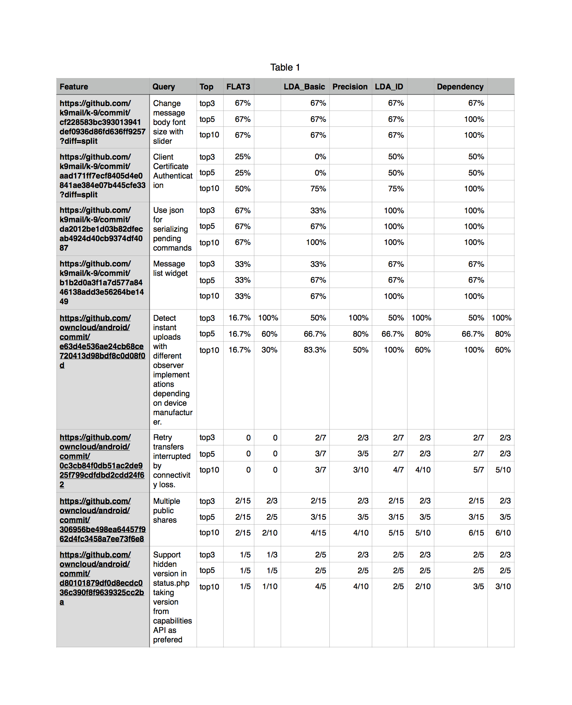

Feature Location on Android Source Code
======

Software maintenance and evolution tasks first require programmers to understand the implementation of specific parts of an existing software system. To do so requires locating the source code that implements functionality, that’s an activity called feature location.

In other words, a feature is a functional requirement of a program, such as spelling checking in a word processor or drawing a shape in a paint program. And the location is the activity of identifying the source code elements, such as methods or files, that implement the feature.

In my research, the scenario is that we have two inputs: the Android source code and a natural language-like query provided by commits in the Github. The output is a list of java files that implement the feature. The group truth is the records with significant change compared to the previous version, which is listed in the Commit file.

Our goal is to find near-complete implementations of features.

Traditionally, there are three approaches to locate the11 source code: Textual, Static and Dynamic. The biggest challenge and difference to previous work is that the flow chart on Android Source Code is not complete compared to that of Java since it runs on the Android Operating System. Right now, we have adapted textual and static feature location techniques to Android Source Code, and have achieved higher accuracy by combining these two techniques according to the characteristics of Android.

## Flowchart:

## Result:
